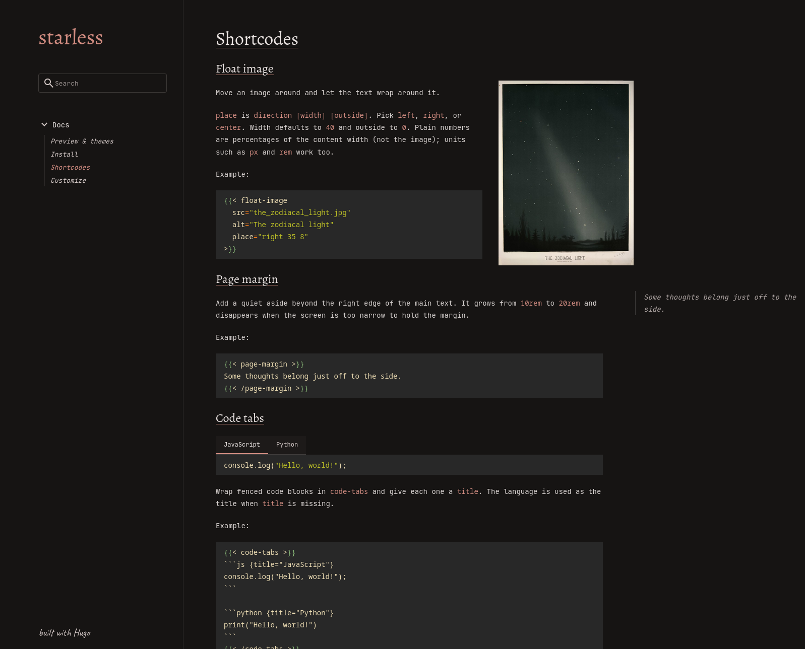
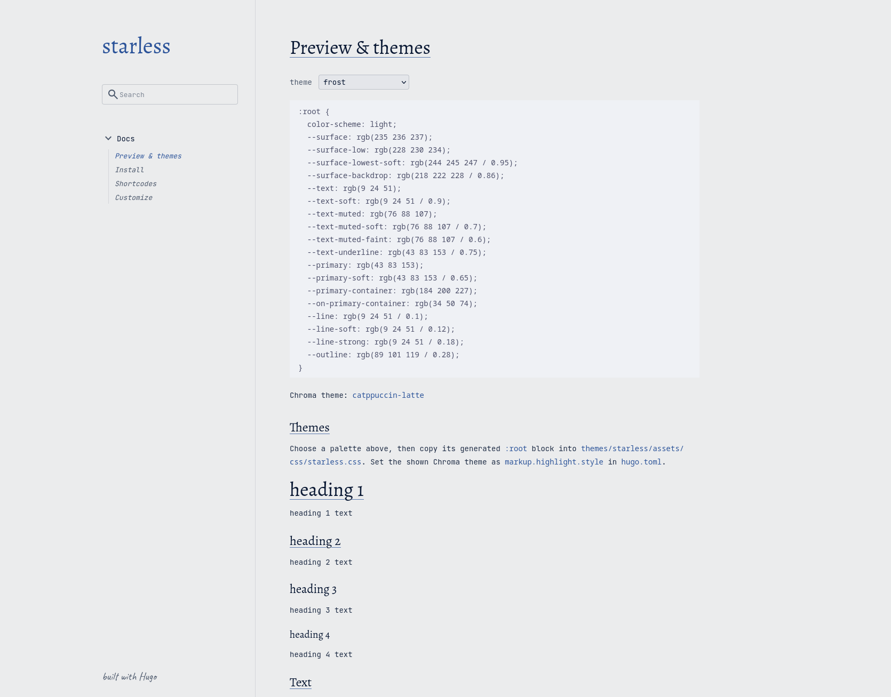
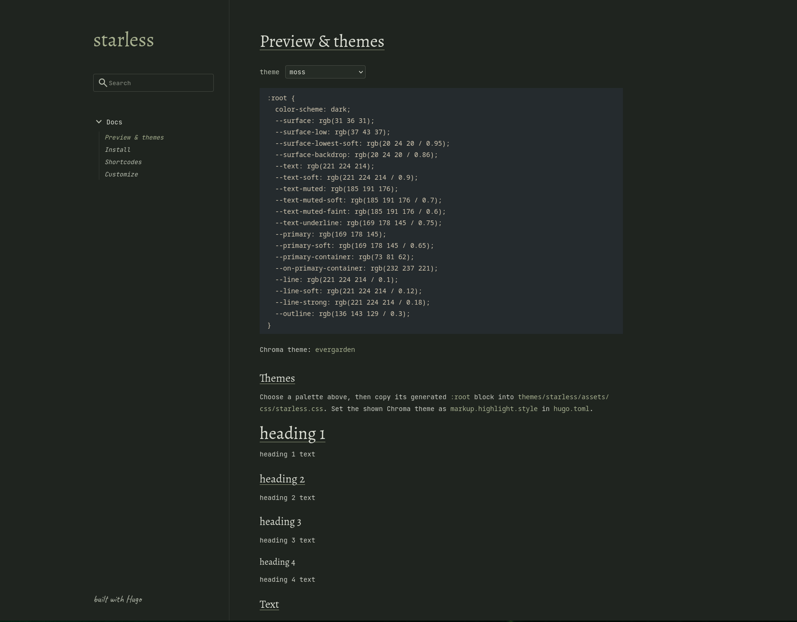
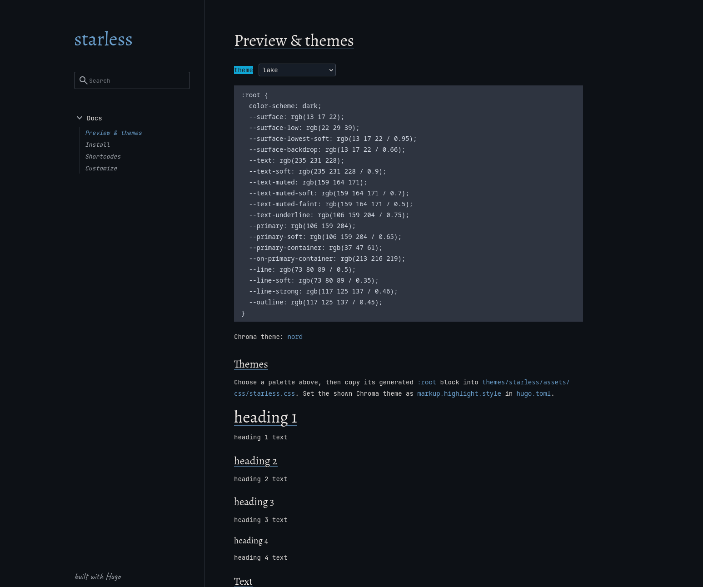

# starless

> I think this is pretty much in a "done" state now. I don't want bloat but suggestions
> within the same aesthetic are welcome

a minimal hugo theme

see it here: [starless.ruiny.de](https://starless.ruiny.de/)

## install

Create a Hugo site if you don't have one:

```sh
hugo new site my-blog-name
cd my-blog-name
```

Clone the theme into your site:

```sh
git clone https://github.com/ruinivist/hugo-starless themes/starless
```

Add this to `hugo.toml`:

```toml
theme = "starless"

[outputs]
home = ["HTML", "RSS", "JSON"]
```

The JSON home output powers search. Then run:

```sh
hugo server
```

For config, see [customize](https://starless.ruiny.de/docs/customize/).

For a preview and themes, see [preview & themes](https://starless.ruiny.de/docs/how-it-looks/).

## screens








