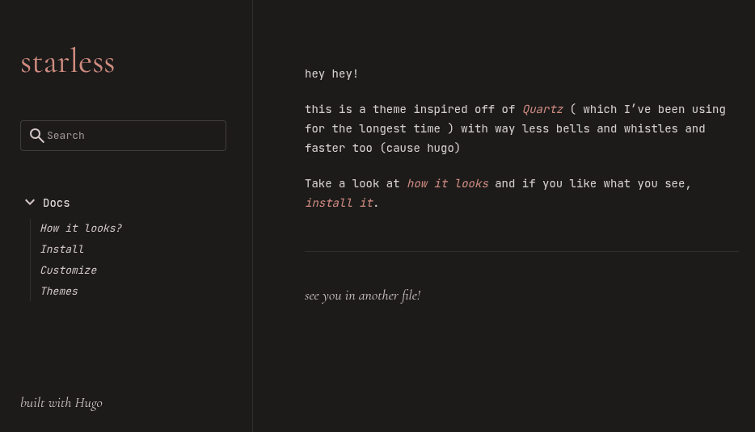
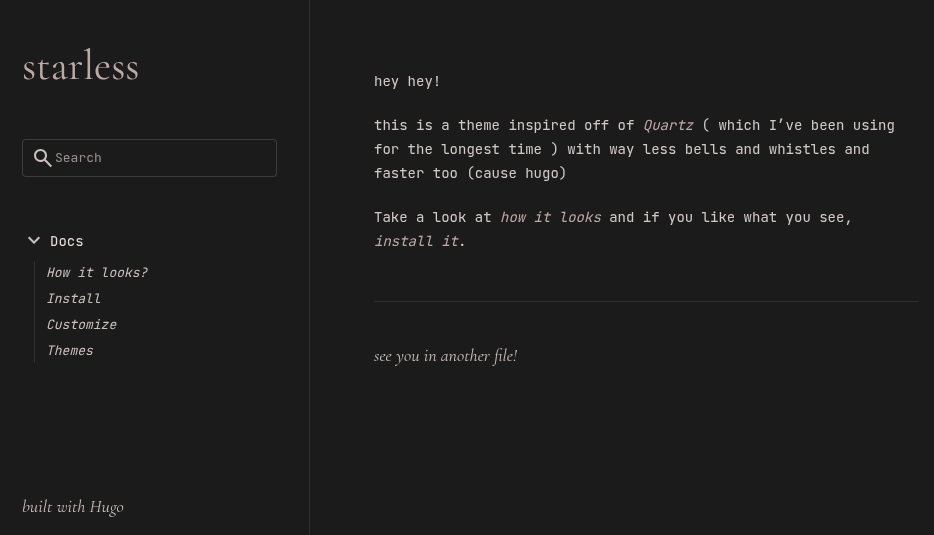
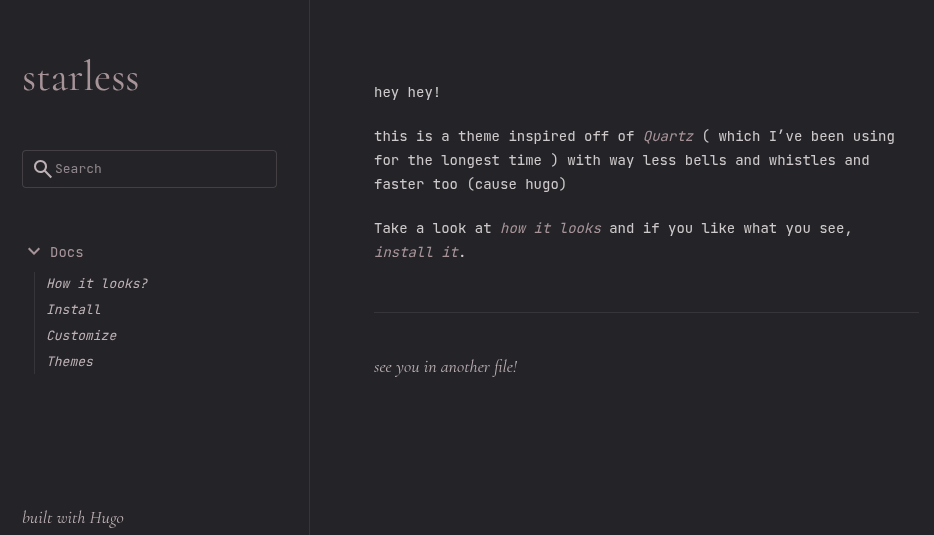
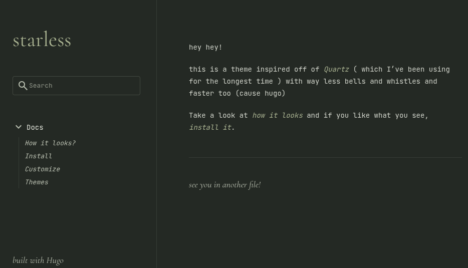
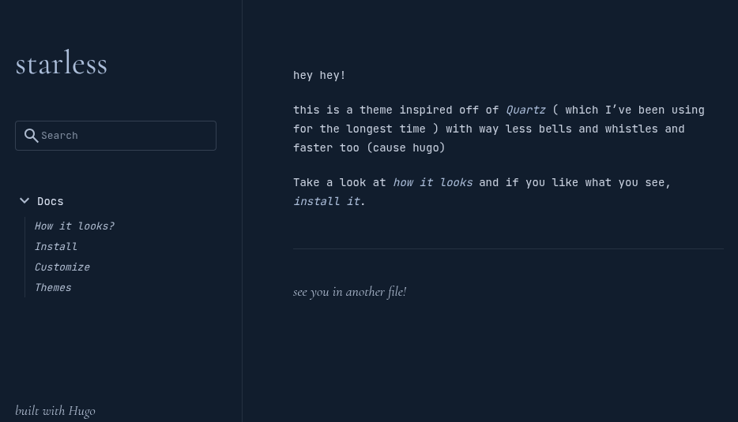
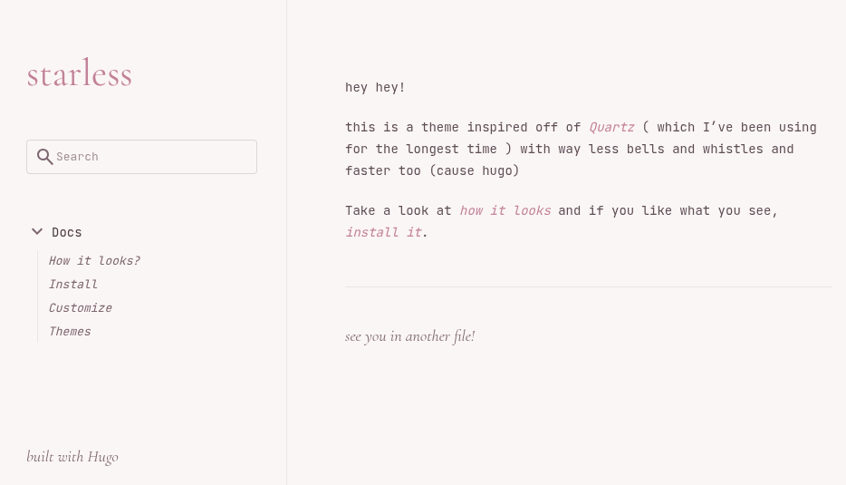

+++
title = "Themes"
summary = "change the palette"
weight = 4
+++

I don't bundle specific tokens for different theme colors, the way to go would be
to edi the colros directly in `themes/starless/assets/css/starless.css`.
Note that you _would_ want to pick an appropriate chroma theme to go with it too.

Here are some sample configurations

These are the theme color tokens:

## vermillion skies

> "under-vermillion-skies" was what I initially naming this
> but given that my quartz based site had stars and this won't...



```css
:root {
  --surface: rgb(22 20 19);
  --surface-low: rgb(29 26 25);
  --surface-lowest-soft: rgb(12 11 10 / 0.95);
  --surface-backdrop: rgb(12 11 10 / 0.86);

  --text: rgb(234 228 226);
  --text-soft: rgb(234 228 226 / 0.9);
  --text-muted: rgb(210 199 197);
  --text-muted-soft: rgb(210 199 197 / 0.7);
  --text-muted-faint: rgb(210 199 197 / 0.6);
  --text-underline: rgb(234 228 226 / 0.35);

  --primary: rgb(209 140 129);
  --primary-soft: rgb(209 140 129 / 0.65);
  --primary-container: rgb(91 44 35);
  --on-primary-container: rgb(255 218 207);

  --line: rgb(234 228 226 / 0.1);
  --line-soft: rgb(234 228 226 / 0.12);
  --line-strong: rgb(234 228 226 / 0.18);
  --checkbox-border: rgb(234 228 226 / 0.45);
  --outline: rgb(150 141 138 / 0.3);
}
```

## classique



```css
:root {
  --surface: rgb(21 20 20);
  --surface-low: rgb(27 25 25);
  --surface-lowest-soft: rgb(14 13 13 / 0.95);
  --surface-backdrop: rgb(14 13 13 / 0.86);

  --text: rgb(228 221 217);
  --text-soft: rgb(228 221 217 / 0.9);
  --text-muted: rgb(203 192 188);
  --text-muted-soft: rgb(203 192 188 / 0.7);
  --text-muted-faint: rgb(203 192 188 / 0.6);
  --text-underline: rgb(228 221 217 / 0.35);

  --primary: rgb(190 170 166);
  --primary-soft: rgb(190 170 166 / 0.65);
  --primary-container: rgb(72 58 56);
  --on-primary-container: rgb(239 224 220);

  --line: rgb(228 221 217 / 0.1);
  --line-soft: rgb(228 221 217 / 0.12);
  --line-strong: rgb(228 221 217 / 0.18);
  --checkbox-border: rgb(228 221 217 / 0.45);
  --outline: rgb(147 138 135 / 0.3);
}
```

## muted blossom



```css
:root {
  --surface: rgb(31 29 34);
  --surface-low: rgb(38 35 41);
  --surface-lowest-soft: rgb(20 19 22 / 0.95);
  --surface-backdrop: rgb(20 19 22 / 0.86);

  --text: rgb(226 221 222);
  --text-soft: rgb(226 221 222 / 0.9);
  --text-muted: rgb(190 178 182);
  --text-muted-soft: rgb(190 178 182 / 0.7);
  --text-muted-faint: rgb(190 178 182 / 0.6);
  --text-underline: rgb(226 221 222 / 0.35);

  --primary: rgb(168 149 154);
  --primary-soft: rgb(168 149 154 / 0.65);
  --primary-container: rgb(77 62 68);
  --on-primary-container: rgb(238 222 225);

  --line: rgb(226 221 222 / 0.1);
  --line-soft: rgb(226 221 222 / 0.12);
  --line-strong: rgb(226 221 222 / 0.18);
  --checkbox-border: rgb(226 221 222 / 0.45);
  --outline: rgb(139 130 134 / 0.3);
}
```

## moss



```css
:root {
  --surface: rgb(31 36 31);
  --surface-low: rgb(37 43 37);
  --surface-lowest-soft: rgb(20 24 20 / 0.95);
  --surface-backdrop: rgb(20 24 20 / 0.86);

  --text: rgb(221 224 214);
  --text-soft: rgb(221 224 214 / 0.9);
  --text-muted: rgb(185 191 176);
  --text-muted-soft: rgb(185 191 176 / 0.7);
  --text-muted-faint: rgb(185 191 176 / 0.6);
  --text-underline: rgb(221 224 214 / 0.35);

  --primary: rgb(169 178 145);
  --primary-soft: rgb(169 178 145 / 0.65);
  --primary-container: rgb(73 81 62);
  --on-primary-container: rgb(232 237 221);

  --line: rgb(221 224 214 / 0.1);
  --line-soft: rgb(221 224 214 / 0.12);
  --line-strong: rgb(221 224 214 / 0.18);
  --checkbox-border: rgb(221 224 214 / 0.45);
  --outline: rgb(136 143 129 / 0.3);
}
```

## ocean



```css
:root {
  --surface: rgb(8 23 41);
  --surface-low: rgb(12 29 49);
  --surface-lowest-soft: rgb(5 16 29 / 0.95);
  --surface-backdrop: rgb(5 16 29 / 0.86);

  --text: rgb(220 228 242);
  --text-soft: rgb(220 228 242 / 0.9);
  --text-muted: rgb(175 188 208);
  --text-muted-soft: rgb(175 188 208 / 0.7);
  --text-muted-faint: rgb(175 188 208 / 0.6);
  --text-underline: rgb(220 228 242 / 0.35);

  --primary: rgb(172 190 218);
  --primary-soft: rgb(172 190 218 / 0.65);
  --primary-container: rgb(59 79 110);
  --on-primary-container: rgb(229 236 247);

  --line: rgb(220 228 242 / 0.1);
  --line-soft: rgb(220 228 242 / 0.12);
  --line-strong: rgb(220 228 242 / 0.18);
  --checkbox-border: rgb(220 228 242 / 0.45);
  --outline: rgb(130 145 168 / 0.3);
}
```

## blossom



```css
:root {
  --surface: rgb(251 246 246);
  --surface-low: rgb(245 238 239);
  --surface-lowest-soft: rgb(255 250 251 / 0.95);
  --surface-backdrop: rgb(255 247 249 / 0.86);

  --text: rgb(74 56 64);
  --text-soft: rgb(74 56 64 / 0.9);
  --text-muted: rgb(125 102 111);
  --text-muted-soft: rgb(125 102 111 / 0.7);
  --text-muted-faint: rgb(125 102 111 / 0.6);
  --text-underline: rgb(74 56 64 / 0.22);

  --primary: rgb(195 131 154);
  --primary-soft: rgb(195 131 154 / 0.65);
  --primary-container: rgb(248 221 229);
  --on-primary-container: rgb(114 53 76);

  --line: rgb(74 56 64 / 0.09);
  --line-soft: rgb(74 56 64 / 0.12);
  --line-strong: rgb(74 56 64 / 0.18);
  --checkbox-border: rgb(125 102 111 / 0.45);
  --outline: rgb(149 130 138 / 0.28);
}
```
